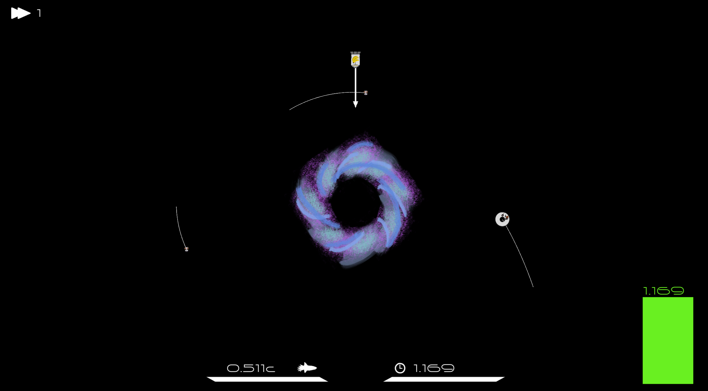

# Space monkeys

This project is a prototype of a 2d arcade game.

<p align="center">
    
</p>

There is a space ship with a load of bananas, a black hole and a space station full of hungry monkeys orbiting it.
Your task is to launch the space ship with an initial velocity such that it will arrive at the space station,
and thereby deliver the bananas. But beware! There are other objects with which you might crash and,
crucially, during the flight we measure your time dilation, and the higher it gets the greater your reward!

The physics are fully general relativistic, integrated to fifth order, and so your ship's time will
dilate the faster it goes and the closer to the black hole it gets. The simulation runs in the time
of a distant observer (the player).

When you start the game and click play you will load into a cluster of several black holes.
Simply click on the one you would like to play. There are two types of featured black holes
  * Schwarzschild (non rotating, invisible, just black)
  * Kerr (rotating, with colorful accretion disk)

The HUD shows your ships speed as a fraction of lightspeed $c$ and your ships current time dilation as factor.
A dilation of 1 means the ship's time goes as fast as the one of the distant observer (the player), factor 2 means twice as fast etc.
On the right there is a green bar showing the highest time dilation you've had during this flight (which is the one that counts).

### Project state

This was a passion project during my study of general relativity in 2021. It is in a proof of concept state,
and if it were to be seriously developed some major overhauls might be in order. For the time being there are no
concrete plans to continue working on it.

## Dependencies

This project was developed using the [SFML](https://www.sfml-dev.org/) library version 2.5.

### Ubuntu/Debian:

Install SFML with:

```
sudo apt install libsfml-dev
```

### NixOS
You can add the dev shell found in [my NixOS configuration](https://github.com/julianbuerge/.mynixos) in `.mynixos/devshells/spacemonkeys-shell.nix` to your flake outputs. Then clonethis repository and enter the shell.

## Build instructions

To build the project do
```
make
```
To clean the build do
```
make clean
```
To run the built project do
```
./spacemonkeys
```
and enjoy!

### Display settings
The game window size is handled in `main.cpp` at the top with
```
//window size
float stretch = 0.9;

float width = 2560*stretch;
float height = 1440*stretch;
```
If the window size does not work for you, either resize it (might change the aspect ratio) or adjust
the `stretch` to fit within your screen resolution.

## License

This code is the intellectual property of Julian Bürge. All rights reserved.

You may view the code for personal, professional or academic interest, but you may not copy, modify, distribute, or use it in any form without prior written permission from the author.

For inquiries, please contact juliandominikbuerge@gmail.com.
